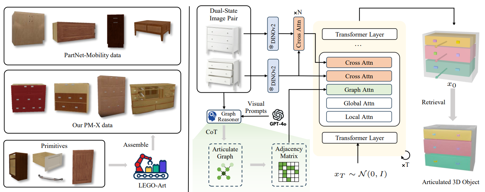
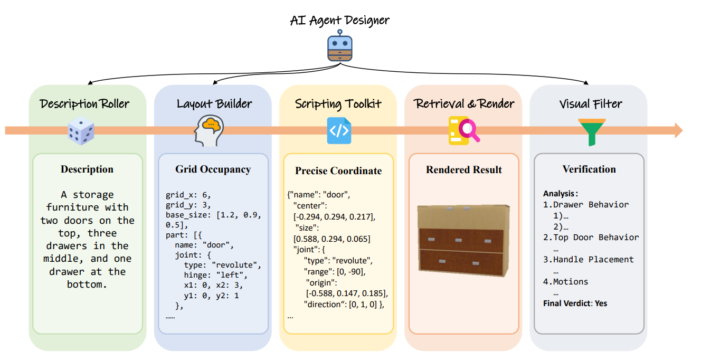

# <p align="center"> DIPO: Dual-State Images Controlled Articulated Object Generation Powered by Diverse Data </p>


 

:rocket: This repository is the official implementation of [DIPO](https://arxiv.org/pdf/2505.20460), which is a framework that generate articulated objects conditioned on **Dual-State Image Pairs** (resting and articulated states)

> **DIPO: Dual-State Images Controlled Articulated Object Generation Powered by Diverse Data**<br>
> Ruiqi Wu, Xinjie Wang, Liu Liu, Chunle Guo*, Jiaxiong Qiu, Chongyi Li, Lichao Huang, Zhizhong Su, Ming-Ming Cheng
><br>( * indicates corresponding author)

[[Arxiv Paper](https://arxiv.org/pdf/2505.20460)]&nbsp;
[[Website Page](https://rq-wu.github.io/projects/LAMP/index.html)]&nbsp;
[[PM-X (dataset)]()]&nbsp;
[[Gradio Demo](https://colab.research.google.com/drive/1Cw2e0VFktVjWC5zIKzv2r7D2-4NtH8xm?usp=sharing)]&nbsp;



## Preparation
### Dependencies and Installation
We recommend to use [miniconda](https://docs.anaconda.com/miniconda/) to manage the environment. The environment was tested on Ubuntu 20.04.4 LTS.
```
# Create a conda environment
conda create -n dipo python=3.10
conda activate dipo

# Install Pytorch
conda install pytorch==2.3.1 torchvision==0.18.1 torchaudio==2.3.1 pytorch-cuda=11.8 -c pytorch -c nvidia

# Install other packages
pip install -r requirement.txt

# Install Pytorch3D (for evaluation)
pip install "git+https://github.com/facebookresearch/pytorch3d.git"
```

### GPT-4o Settings
input your key of GPT-4o in `scripts/graph_pred/api.py`.
```
client = AzureOpenAI(
    azure_endpoint="your_endpoint",
    api_key="your_key",
    api_version="your_version",
)
```

## Download Data

### PM-X Dataset
Our PM-X dataset is constructed by an agent system, named LEGO-Art. It builds complex articulated objects with primitives provieded by Partnet-Mobility dataset. You can download the novel dataset at [link]().


### PM + ACD Dataset
You can download the origin data and our proprocessed data from [here], for training and evaluation.

## Usage
### Quick Demo
We provide a quick demo to run the inference on an example input image located at `demo/demo_input.png`. This script will take the example image as input, predict part connectivity graph using [GPT-4o](https://openai.com/index/hello-gpt-4o/), extract image feature using [DinoV2](https://github.com/facebookresearch/dinov2), and generate articulated object using our model. Please make sure that the model checkpoint and preprocessed data (from PartNet-Mobility) are downloaded. 
```
# To run the whole package
python demo/demo.py
```
If you don't have the OpenAI API key yet, you can opt to skip the graph prediction by using our given graph `demo/example_graph.json` that is parsed from the GPT response.
```
# To skip the graph prediction using GPT-4o
python demo/demo.py --use_example_graph
```
If you successfully run the script, the output will be saved at `demo/demo_output`. By default, there will be three objects generated out by initializing with different noises.
For other configuration, please see the arguments in the script.

### Evaluation
If you're interested in evaluating our model on the test set (see the data split in `data/data_split.json` for PartNet-Mobility, and in `data/data_acd.json` for ACD dataset), you can run the test script as below. 
```
# Evaluate on the test set (given GT graph, no object category label)
python test.py \
    --config exps/singapo/final/config/parsed.yaml \
    --ckpt exps/singapo/final/ckpts/last.ckpt \ 
    --label_free \
    --which_data pm
```
We also share the graph prediction results [here](https://aspis.cmpt.sfu.ca/projects/singapo/pred_graph.zip) so that you can run the evaluation by taking the graph prediction from GPT-4o as input. Once downloaded, you can put it under the `exps` directory, as shown in the following file structure.
```
<project directory>
├── exps
│   ├── predict_graph
│   │   ├── acd_test
│   │   ├── pm_test
```
To use these recordings of the graph prediction for evaluation, you need to specify the path to one of the prediction folders `--G_dir`. For example,
```
# Evaluate on the test set (given predicted graph, no object category label)
python test.py \
    --config exps/singapo/final/config/parsed.yaml \
    --ckpt exps/singapo/final/ckpts/last.ckpt \
    --label_free \
    --which_data pm \ 
    --G_dir exps/pred_graph/pm_test
```
The evaluation is only supported on a single GPU, which was tested on a NVIDIA 3060 (12GB).

### Training
To train our model from scratch, the preprocessed data from PartNet-Mobility (downloaded [here](https://aspis.cmpt.sfu.ca/projects/singapo/data/pm.zip)) and our augmented data (downloaded [here](https://aspis.cmpt.sfu.ca/projects/singapo/data/augmented_train.zip)) is required. 

We train our model on top of a [CAGE](https://3dlg-hcvc.github.io/cage/) model pretrained under our setting. This checkpoint can be downloaded [here](https://aspis.cmpt.sfu.ca/projects/singapo/ckpts/pretrained_cage.zip), which is put under `pretrained` folder by default.
```
<project directory>
├── pretrained
│   ├── cage_cfg.ckpt
```
Run the following command to train our model from scratch. The original model is trained on 4 NVIDIA A100s.
```
python train.py \
    --config configs/config.yaml \
    --pretrained_cage pretrained/cage_cfg.ckpt
```

## Citation
```
@article{wu2025dipo,
  title={DIPO: Dual-State Images Controlled Articulated Object Generation Powered by Diverse Data},
  author={Wu, Ruqi and Wang, Xinjie and Liu, Liu and Guo, Chunle and Qiu, Jiaxiong and Li, Chongyi and Huang, Lichao and Su, Zhizhong and Cheng, Ming-Ming},
  journal={arXiv preprint arXiv:2505.20460},
  year={2025}
}
```